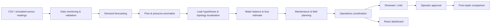

# AquaSentinel — Water Distribution Decision Support Prototype

A local, GitHub-ready prototype for the supplied Agentic AI Water Distribution Leak Detection & Resource Optimization brief. It combines synthetic sensor data, a multi-agent analysis workflow, a scikit-learn demand model, an interactive dashboard, human review actions, and post-repair comparison.

> This is a demonstration and decision-support system. It does not control pumps, valves, treatment, or other production infrastructure. A flow-demand difference is an investigation signal, not proof of leakage.

## Features

- FastAPI API with SQLite persistence for network assets, teams, sensor readings, operator decisions, field actions, and workflow events; includes CSV/REST ingestion, reassessment, and JSON/PDF reports.
- Eight specialized agents: data monitoring/quality, demand forecasting, flow and pressure anomaly detection, leak detection/localization, water balance, maintenance planning, operations coordination, and reviewer/critic.
- Actual `scikit-learn` LinearRegression model trained at runtime against repeatable synthetic hourly history (720 rows; cyclic hour and weekend features), with a time-ordered holdout MAE/RMSE. These metrics use synthetic data and do not validate a utility forecast.
- Deterministic water balance and priority calculation with explicit assumptions.
- Three DMA sample network, normal and abnormal flow/pressure readings, a negative sensor reading, and nighttime-flow history.
- Eight brief-aligned automated scenario tests in `backend/tests/test_scenarios.py`.
- Simulated event batches for normal, leak, repair, and sensor-fault conditions; each new batch triggers all agents again.
- React/TypeScript frontend with all 13 requested sections: dashboard, network configuration, live map, sensor monitoring, demand forecasting, leak detection, pressure/flow analytics, water balance, field operations, maintenance planning, AI operations, alerts, and reports.

## Architecture



The hydraulic scenario and topology are synthetic, while operator changes and incoming data are saved in `backend/water_ops.sqlite3`. `backend/data/` contains starter datasets. GIS coordinates, a real LLM, MQTT, and live utility feeds are not included; see “Scope and limitations”.

## Requirements

- Python 3.10 or newer
- Node.js 18 or newer and npm
- VS Code (recommended)

## Run locally in VS Code

Open the project root folder in VS Code. Open two integrated terminals.

### Terminal 1: backend

```bash
cd backend
python3 -m venv venv
./venv/bin/python -m pip install --upgrade pip
./venv/bin/python -m pip install -r requirements.txt
./venv/bin/python -m uvicorn app.main:app --reload --port 8000
```

The API is at `http://127.0.0.1:8000`; interactive API docs are at `http://127.0.0.1:8000/docs`.

Run the eight demo scenarios from a backend terminal after installing dependencies:

```bash
cd backend
./venv/bin/python -m pytest -q
```

### Terminal 2: frontend

```bash
cd frontend
npm install --cache .npm-cache
npm run dev
```

Open the URL printed by Vite (normally `http://localhost:5173`). Vite proxies `/api` to the backend.

## Demo workflow

1. Start both services and open the dashboard.
2. The dashboard loads the three-DMA scenario. DMA-B has 510 m³/h inlet flow, 390 m³/h estimated demand, and 2.8 bar pressure. Historical nighttime flow is also elevated.
3. The monitoring agent excludes the impossible -3 bar pressure measurement from analysis.
4. The analysis creates a leak hypothesis and explains evidence, caveats, and suggested verification. The location is an inferred network section, not a physical pinpoint.
5. Use **Review & approve** or **Dismiss hypothesis** to record an operator decision. No infrastructure command is sent.
6. Use **Run post-repair comparison** to compare illustrative before/after measurements.
7. **Export report** downloads a formatted PDF report. The structured report data is available at `/api/report`.

## Frontend pages

The left navigation opens a dedicated page for each item below. Pages that use demo or schematic data label that limitation in the UI.

1. Water Operations Dashboard
2. Network Configuration (add, edit, delete network assets)
3. Live Network Map (schematic topology and asset status)
4. Sensor Monitoring (CSV upload and simulated event stream)
5. Demand Forecasting (model outputs and synthetic holdout metrics)
6. Leak Detection Center (evidence, confidence, contradiction, human decision)
7. Pressure & Flow Analytics
8. Water Balance
9. Field Operations (team creation, assignment and action status)
10. Maintenance Planning
11. AI Operations Center (agent input/output trace and workflow events)
12. Alert Center
13. Reports (PDF and JSON)

## Agent responsibilities

| Agent | Current implementation |
|---|---|
| Water Network Data Monitoring | Checks ISO timestamps, duplicate IDs/times, negative values, type/unit match and ingested reading freshness |
| Water Demand Forecasting | Fits LinearRegression on synthetic hourly demand, reports time holdout MAE/RMSE and zone estimates |
| Flow & Pressure Anomaly Detection | Forecast residual, pressure floor, and nighttime baseline rules |
| Leak Detection & Localization | Correlates hydraulic signals and infers affected DMA/section from NetworkX graph |
| Water Balance & Loss Analysis | Deterministic inflow minus estimated demand, percentage and illustrative 6-hour volume |
| Maintenance & Field Resource Planning | Transparent priority formula; field workflow checks availability and prevents concurrent team assignments |
| Water Operations Coordination | Summarizes evidence and requires operator approval |
| Operations Reviewer / Critic | Checks invalid readings exclusion, arithmetic, location language, and human approval gate |

Agents are ordinary deterministic Python functions that exchange a shared workflow dictionary. This makes the demo reproducible and inspectable; it is agent-style orchestration rather than autonomous LLM reasoning.

## Methods and assumptions

- **Validation:** rejects negative values, invalid ISO timestamps, duplicate sensor/time pairs, and type/unit mismatches. Incoming readings older than 30 minutes are stored as stale and excluded from hydraulic analysis. Production ingestion should add sensor-specific ranges, calibration, and unit conversions.
- **Forecast:** 30 days × 24 synthetic observations are generated consistently at runtime. Features are sine/cosine hour encodings and a weekend flag. A chronological 21-day/9-day holdout reports MAE/RMSE on synthetic demand only. Replace the synthetic series with labeled utility history before using the scores for any real decision.
- **Anomalies:** flow is abnormal above forecast by `max(30 m³/h, 12%)`; pressure is flagged below 3.2 bar; nighttime flow is abnormal above 1.25× historical baseline. These are demonstration thresholds and should be configured and calibrated by the utility.
- **Leak confidence:** starts at 0.28 and adds 0.24 per independent signal type, capped at 0.95. This is a heuristic confidence score, not a calibrated probability.
- **Localization:** a small NetworkX graph supports affected zone/adjacent section identification. No coordinates or underground leak pinpoint are asserted.
- **Water balance:** unexplained difference = supplied flow − estimated/metered demand; percentage = difference ÷ supplied flow × 100. Potential volume = positive excess × assumed six-hour duration. A full NRW calculation needs authorized unbilled consumption, apparent losses, meter inaccuracies, and data adjustment rules.
- **Priority:** `confidence × 45 + positive unexplained m³/h × 0.25 + 15 if low pressure`, capped at 100. Team assignments and availability are stored in SQLite; active assignments reserve a team until completion, verification, or cancellation.
- **Field workflow:** assets, teams, sensor readings, operator decisions, field actions, and event history persist in SQLite.
- **Post-repair:** compares user-provided before/after flow and pressure. Improvement is evidence for review, not final repair confirmation.

## API

| Method | Path | Purpose |
|---|---|---|
| GET | `/api/health` | Service health |
| GET | `/api/network` | Sample network and team data |
| GET | `/api/demo` | Run full synthetic agent workflow |
| POST | `/api/simulate` | Emit a simulated sensor batch (`normal`, `leak`, `repair`, `sensor_fault`) and reassess |
| POST | `/api/reassess` | Re-run with payload fields overriding demo state |
| POST | `/api/decision/{leak_id}` | Record approve/reject operator decision |
| POST | `/api/post-repair` | Compare before/after flow and pressure |
| GET | `/api/report` | Structured machine-readable report data |
| GET | `/api/report.pdf` | Download a generated PDF report |
| POST | `/api/ingest/csv` | Validate/store a CSV upload (`sensor_id,zone,type,timestamp,value,unit`) and reassess |
| GET/POST/PUT/DELETE | `/api/assets` | Manage assets (item path for PUT/DELETE) |
| GET/POST | `/api/teams` | List or add field teams |
| GET/POST | `/api/readings` | List or ingest readings through REST; new readings trigger reassessment |
| GET/POST/PATCH | `/api/actions` | List, create, or update field actions (item path for PATCH) |
| GET | `/api/events` | View workflow event history |

Example reassessment body:

```json
{
  "inflow": {"DMA-A": 420, "DMA-B": 530, "DMA-C": 350},
  "pressure": {"DMA-A": 4.2, "DMA-B": 2.5, "DMA-C": 4.0}
}
```

## Repository contents

```text
backend/
  app/main.py                 FastAPI routes and seeded scenario
  app/agents/core.py          Multi-agent workflow and numerical logic
  app/store.py                SQLite persistence and seed assets/team
  tests/test_scenarios.py     Eight workflow scenario tests
  data/                       Network, flow, pressure, demand, leak and team CSV samples
frontend/
  src/App.tsx                 Dashboard and operator actions
  src/style.css               Responsive dashboard styles
```

## GitHub

From this project root, initialize and push to a repository you create on GitHub:

```bash
git init
git add README.md backend frontend
git commit -m "Build AquaSentinel water operations prototype"
git branch -M main
git remote add origin https://github.com/YOUR_USERNAME/YOUR_REPOSITORY.git
git push -u origin main
```

Do not commit virtual environments, `node_modules`, credentials, or real utility data. Add a `.gitignore` before your first commit.

## Scope and limitations before submission

This code is a runnable submission prototype, not a production utility system. Excel ingestion, hosted deployment, GIS coordinates/basemap, authenticated roles, MQTT, and real network feeds are not included. SQLite is local; back it up if you need to retain its contents. Forecast holdout metrics use synthetic data and do not establish real-world accuracy. CSV and REST ingestion classify readings as invalid, stale (older than 30 minutes), or valid before persistence. Use synthetic data only in the demo. Before operational decisions, a utility team must validate thresholds, data, sensor health, permissions, and workflow behavior.
